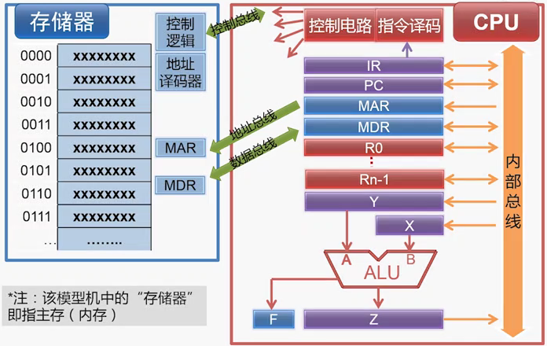
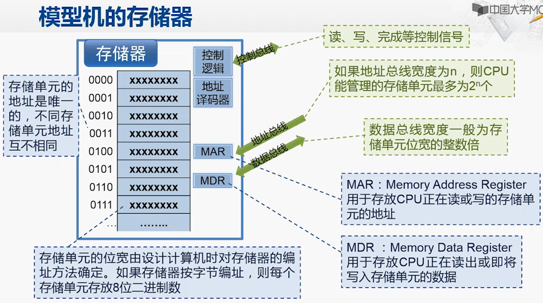
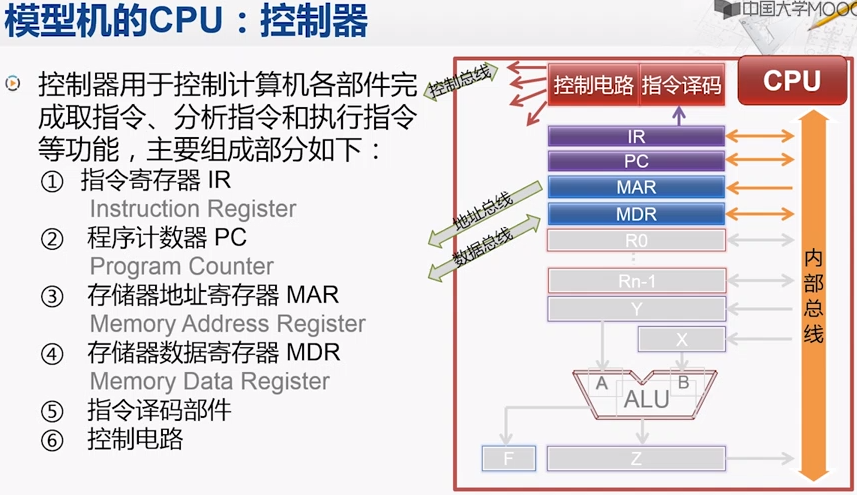
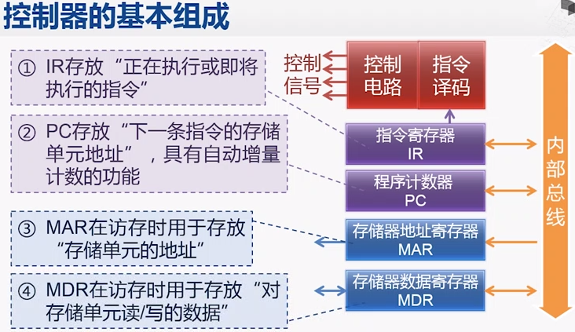
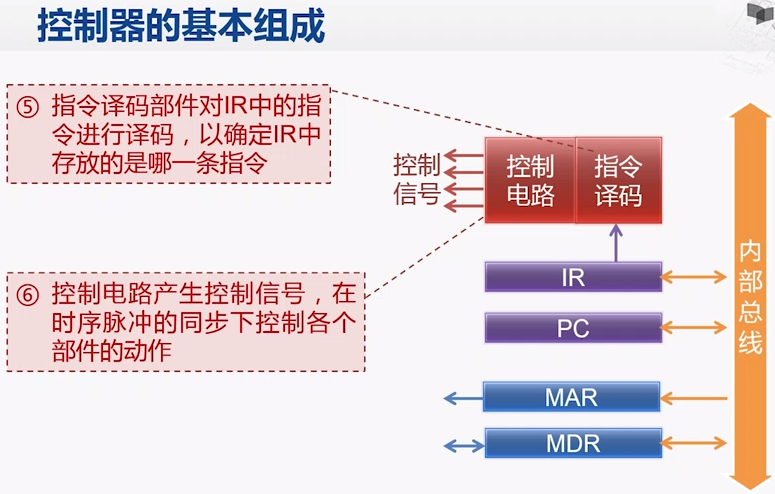
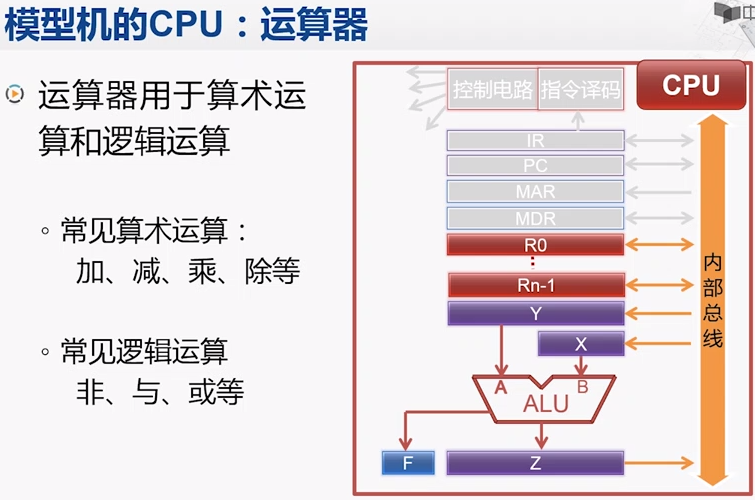
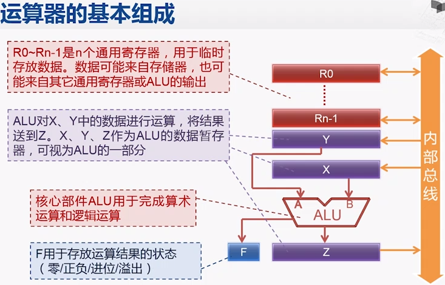
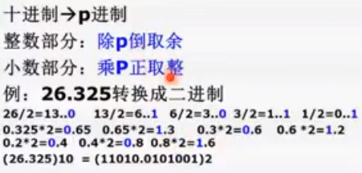
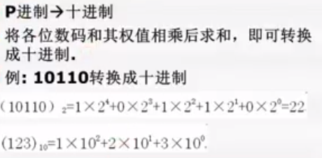

#### Computer Organization And Design

  Programmers who seek to build competitive versions of software will therefore need to increase their knowledge of computer organization.

- Eight Great Ideas in Computer Architecture
  
  Design for Moore's Law  
  Use Abstraction to Simplify Design  
  Make the Common Case Fast  
  Performance via Parallelism  
  Performance via Pipelining  
  Performance via Prediction  
  Hierarchy of Memories  
  Dependability via Redundancy

### 冯.诺依曼

  运算器，CA：central arithmetical  
  控制器，CC：central control  
  存储器，M ：memory  
  输入，I   ：input  
  输出，O   ：output

#### 模型机

  
  
  - 存储器
    
    
  
  - 控制器
    
      
      
    

  - 运算器
  
      
    
  
#### 指令执行主要步骤

  取指（fetch）  
  译码（decode）  
  执行（execute）  
  回写（write-back）

#### 外频

外部频率或基频，也叫系统时钟频率。  
系统振荡器——>(外频信号)——>频率放大

#### CPU 性能指标

1. 主频 = 外频 x 倍频系数
2. ips，每秒执行指令数

### 进制转换

    
  

### 编码

- 原码
  
- 反码
  
- 补码
  