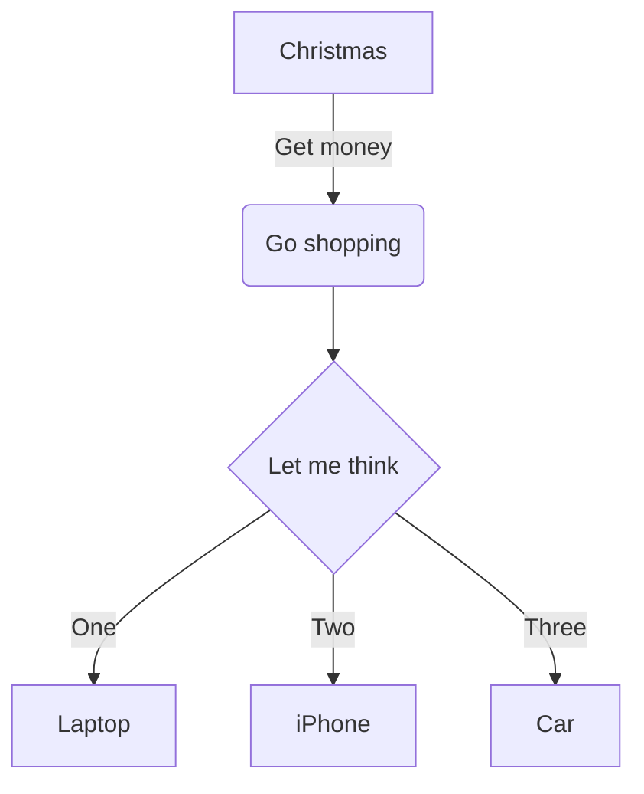

# Computer Organization And Design
#### 进制转换

#### 原码 反码 补码

#### 运算器

MQ
ACC
ALU
X
PSW

#### 存储器
MAR Memory Address Register
MDR Memory Data Register

#### 外频

外部频率或基频，也叫系统时钟频率。
系统振荡器——>(外频信号)——>频率放大

#### CPU 性能指标

1. 主频 = 外频 x 倍频系数
2. ips，每秒执行指令数