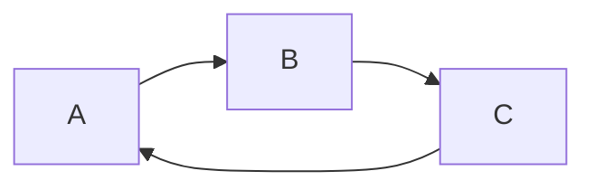
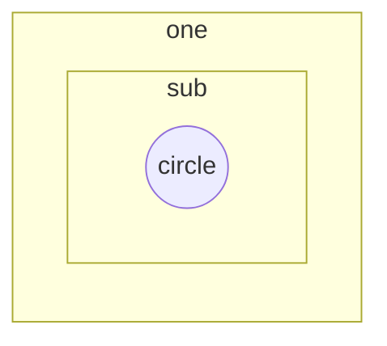

```mermaid
graph LR
A --> B
B --> C
C --> A
```

```mermaid
graph LR
subgraph one
  subgraph sub
    id((circle))
  end
end
```

### 启动过程
bios -> bootloader -> os

### 操作系统与设备和程序交互
- system call

- exception

- interrupt
