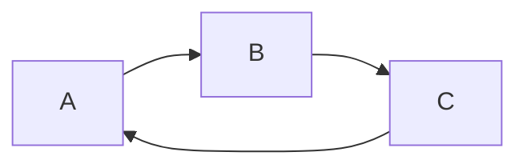
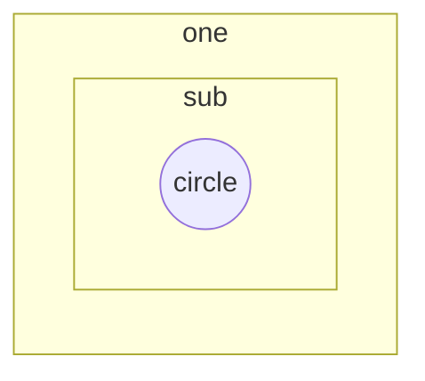

### 启动过程
bios -> bootloader -> os

### 操作系统与设备和程序交互
- system call

- exception

- interrupt

### 跨越操作系统边界开销
- 建立中断/异常/系统调用号与对应服务例程映射关系的初始化开销
- 建立内核堆栈
- 验证参数
- 内核态映射到用户态的地址空间（更新页面映射权限）
- 内核态独立地址空间（TLB）
